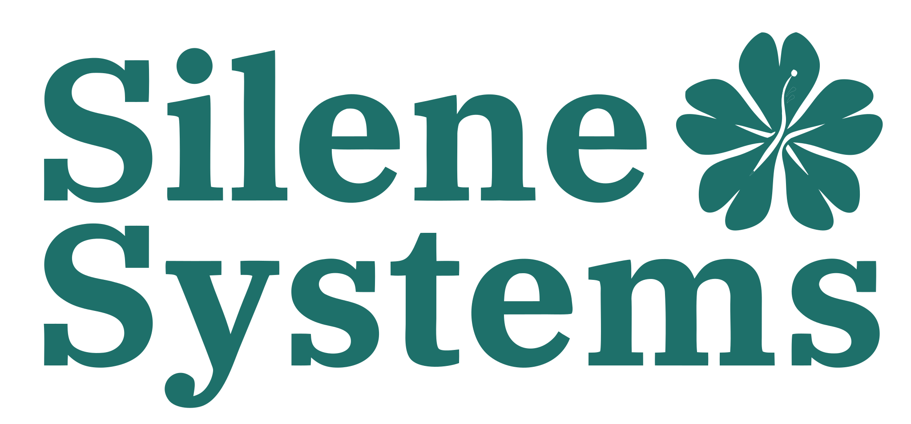

# Silene Systems — Static Marketing Site

<p align="center">
  
</p>

<p align="center">
  <strong>Local, production-ready static mirror of the public <a href="https://silene.systems">Silene Systems</a> marketing site</strong>
</p>

---

## Overview

This repository contains a **self-contained static website** that reproduces the Silene Systems landing experience: hero with background video, product pillars, use cases, interactive-style workbench preview, disease database section, call-to-action, and legal pages. The build is optimized for **local preview** and **static hosting** (no Node.js runtime required in production).

The site uses the original compiled **Tailwind CSS** bundle, bundled **IBM Plex** fonts, and lightweight **vanilla JavaScript** for navigation, scroll-triggered motion, and stat animations—without relying on Next.js hydration.

---

## ElderCare Companion (Next.js app)

The **`web/`** workspace contains **ElderCare Companion** (voice-first check-ins, medications, appointments, AI insights, clinic PDF). The marketing site in **`silene-clone/`** is copied into **`web/public`** when you run `npm run dev` or `npm run build` (assets under `/mirror-next` so they do not clash with Next’s `/_next`).

**Run the full site + app (recommended):** from the **repository root**:

```bash
npm install
npm run dev
```

Open [http://localhost:3000](http://localhost:3000). The home page is the Silene landing in an iframe; **Get Started** opens **`/get-started`**, where you choose **Sign in** or **Create account**, then you are sent to **`/app`** (dashboard) after authentication.

- **Environment:** copy `web/.env.example` to `web/.env.local` and add Supabase and (optionally) AI / ElevenLabs keys.
- **Database:** migrations are in **`supabase/migrations/`** at the repo root. Use **`npm run sb:login`** then **`npm run sb:start`** + **`npm run sb:reset`** (Docker required), or **`npm run sb:link`** + **`npx supabase db push`** for a hosted project.

See **`web/README.md`** for details.

---

## Features

| Area | Description |
|------|-------------|
| **Layout & content** | Full landing page sections: hero (`#hero`), platform pillars (`#platform`), use cases, workbench demo (desktop), supported diseases, CTA, footer |
| **Motion** | Framer-style fade/slide reveals on scroll, hero stagger, hero video settle, workbench window animation, optional count-up for aggregate stats |
| **Navigation** | Fixed pill nav (desktop), accessible mobile menu with overlay, in-page anchors, footer links |
| **Legal** | Standalone `/privacy/` and `/terms/` pages with shared styling |
| **Deploy** | Ready for Vercel, Netlify, Cloudflare Pages, S3/CloudFront, or any static file host |
| **Accessibility** | `prefers-reduced-motion` respected; ARIA on mobile dialog; keyboard Escape closes menu |

---

## Requirements

- **Node.js 20+** (for ElderCare + embedded landing via `npm run dev`)
- **Python 3** (optional — only if you preview **`silene-clone/`** alone with a static file server)
- A modern browser (for video, `IntersectionObserver`, and CSS used in motion)

---

## Quick start

**Landing + ElderCare (single dev server):**

```bash
npm install
npm run dev
```

Open **http://localhost:3000**. **Get Started** links to **`/app`** (ElderCare Companion).

**Static marketing site only** (no ElderCare — **Get Started** targets **`/app`** on the Next server, so use `npm run dev` from the repo root for the full app):

```bash
cd silene-clone
python3 -m http.server 8080
```

Equivalent: `cd silene-clone && npm start` (same Python HTTP server).

---

## Project structure

```
silene-systems/
├── package.json              # npm workspaces — run `npm run dev` from here
├── README.md                 # This file
├── web/                      # Next.js app (ElderCare + synced landing in public/)
└── silene-clone/             # Static marketing source (copied into web/public on dev/build)
```

Legacy layout (static-only deploy):

```
silene-clone/                 # Site root — deploy this folder for static hosting only
├── index.html                # Landing page (source for sync into web/public)
├── site.js                   # Nav + scroll motion + count-up
├── animations.css            # Motion utilities (reveal, hero, workbench)
├── hero.webm                 # Hero background video
├── og.webp                   # Default Open Graph image
├── icon.svg                  # Favicon
├── logo_dark.svg             # Hero / light background
├── logo_light.svg            # Footer / dark background
├── robots.txt
├── vercel.json               # Optional headers (Vercel)
├── netlify.toml              # Optional headers (Netlify)
├── _headers                  # Optional headers (Netlify)
├── privacy/index.html
├── terms/index.html
├── icons/                    # SVG icons (workbench, diseases, etc.)
└── _next/static/             # Original CSS, JS chunks (fonts, main stylesheet), mirrored images
```

---

## Deployment

1. Set the **publish directory** to `silene-clone` (the folder that contains `index.html`).
2. **Canonical & social:** Before going live on your own domain, update `og:url`, `og:site_name`, and use **absolute** URLs for `og:image` / `twitter:image` in `index.html` (see the HTML comment in `<head>`).
3. Optional configs included:
   - **`vercel.json`** — security and cache headers for large assets  
   - **`netlify.toml`** / **`_headers`** — similar for Netlify  

No build step is required; upload or connect the folder as a static site.

---

## Customization

- **Copy & branding:** Replace text, logos (`logo_dark.svg`, `logo_light.svg`), and links as needed for your deployment.
- **Motion:** Adjust timing and easing in `animations.css`; triggers and selectors live in `site.js`.
- **Stats:** Aggregate numbers in the database strip are animated from zero when the section enters view; final values are defined in the HTML (and can be aligned with your data).

---

## Third-party & attribution

Visual design, copy, and assets are derived from the public **Silene Systems** website. If you deploy this project publicly, ensure you have appropriate **rights and permissions** for branding and content, or replace them with your own.

External links (for example to `app.silene.systems`) remain as in the mirrored content unless you change them.

---

## License

This repository is provided as a **static mirror / reference implementation**. It does not grant a license to Silene Systems trademarks or proprietary assets. Use responsibly and in compliance with applicable law and the original rights holders’ terms.
